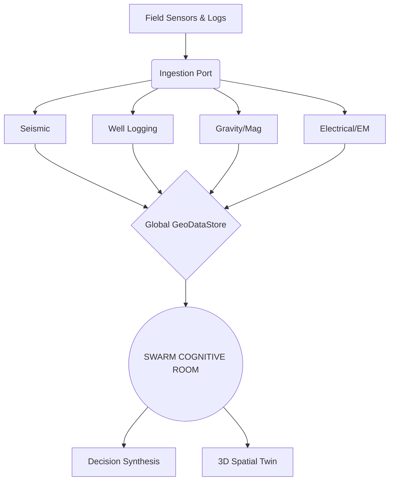

# GeoAI Pro: Geophysics Intelligence Suite

**SYSTEM STATUS:** `OPERATIONAL`
**TELEMETRY:** `STABLE`
**VERSION:** `v4.0.0`

---

## 1. Executive Summary

**GeoAI Pro** is an enterprise-grade, end-to-end Geophysics Intelligence Suite designed for advanced subsurface modeling, high-fidelity economic simulation, and rigorous stakeholder consensus. Engineered for the modern exploration and civil engineering sectors, GeoAI Pro completely revolutionizes how geophysical data is ingested, visualized, and acted upon.

At the heart of the platform is a sophisticated **multi-agent Swarm Intelligence** architecture. This distributed cognitive engine processes incoming raw field sensor data and synthesizes real-time decisions, simulating complex macro-economic and geotechnical scenarios before a single physical drill penetrates terrestrial strata.

---

## 2. System Architecture & Core Modules

The suite dynamically ingests unstructured and structured data across eight distinct diagnostic disciplines, fusing them into a unified Global GeoData Context.

1. **Seismic (.segy)** - Acoustic wavelet analysis, bright spot detection (hydrocarbon/gas indicators), fault line tracing, and structural hazard identification.
2. **Well Logging (.las)** - Advanced telemetry including sonic transit times, deep induction resistivity, and rock porosity metrics.
3. **Spatial Twin (.shp)** - A 3D Spatial Digital Twin mapping absolute virtual drilling coordinates and live slice-plane volumetric models.
4. **Gravity & Magnetic** - Identification of basement rock structures, salt domes, and regional density anomalies via gradiometry mapping.
5. **Electrical & EM (.ohm)** - Mapping Schlumberger Vertical Electrical Sounding (VES) resistivity values and bedrock pseudo-sections.
6. **GPR Waveform (.dzx)** - Near-surface high-resolution hyperbola wavelet analysis and concrete bedrock integrity mapping.
7. **Rock Geochem (.csv)** - Evaluation of QFL ternary mineral abundances and quantification of rare earth element deposits.
8. **Meteorology** - Atmospheric and weather integration monitoring storm velocities, hydrological impacts, and seismology offsets.

---

## 3. The "Swarm Cognitive Room"

The **Swarm Cognitive Room** serves as the autonomous computational brain of GeoAI Pro. Rather than relying on a single deterministic algorithm or single LLM prompt, the engine orchestrates a massive multi-agent boardroom debate involving **14 active domain specialists**.

**The Specialist Roster:**
Dr. Vance, Tanya Rostova, Kenji Takahashi, Sarah Lin, Michael Chen, Alex Rahman, Cpt. Declan Hayes, Sven Olsen, Audi Santosa, Andi Wijaya, Tariq Al-Hashimi, Eleanor Vance, Lars Mikkelsen, Chloe Mendes.

**Simulation Parameters:**
Whenever drilling coordinates are nominated or raw data is parsed, the Swarm Engine engages in high-speed, multi-perspective debates. The agents forcefully negotiate over:
*   **Technical Geophysical Inversion:** Reconciling anomalous sub-surface sensor readings.
*   **Macro-Economy & Supply Chain:** Logistics tracking, state-owned enterprise (SOE) compliance, and multi-billion-dollar contractor estimations.
*   **Social & Watchdog Dynamics:** Evaluating environmental risk, civil consent, NGO optics, and regulatory compliance.

---

## 4. Technical Specifications

GeoAI Pro is built on a resilient, high-performance web architecture designed for uninterrupted mission-critical deployment.

*   **Backend:** Node.js / TypeScript Engine utilizing Express for API routing and complex middleware validation.
*   **Frontend:** React 18 with Tailwind CSS for high-density industrial interfaces.
*   **3D Engine:** Three.js / React Three Fiber for the *Spatial Twin*, executing live shaders and volumetric depth-clipping.
*   **State Management:** Zustand (`GeoDataStore`) for low-latency, cross-module data synchronization.
*   **Intelligence:** Multi-agent Swarm Consensus via GenAI (Google Gemini), utilizing structured JSON schema output for machine-readable logic parsing.
*   **API Strategy & Telemetry:** 
    *   **Global Failover Service:** An automated, self-healing API queue manager with dynamic multi-key rotation.
    *   Designed to intercept `429 Rate Limit` and `503 Service Unavailable` signals, intelligently cycling keys to guarantee **zero-downtime persistence** and continuous swarm processing.

---

## 5. Core Features

*   **Real-time 3D Geological Modelling:** Fully interactive volumetric rendering of sub-surface lithography, complete with Z-axis depth slicing and data-point overlays.
*   **Dynamic API Failover Engine:** Unbreakable AI connectivity. The system intelligently monitors network telemetry and automatically hot-swaps generation keys if provider interference is detected.
*   **Stakeholder Consensus Simulator:** Emulate real-world bureaucratic, financial, and geotechnical friction through autonomous multi-agent debates.
*   **Unified Field-Data Ingestion & Synthesis:** Drag-and-drop parsing for disparate field file formats, instantly standardizing data into the global context vector.

---
*Developed for unparalleled geotechnical superiority.*
